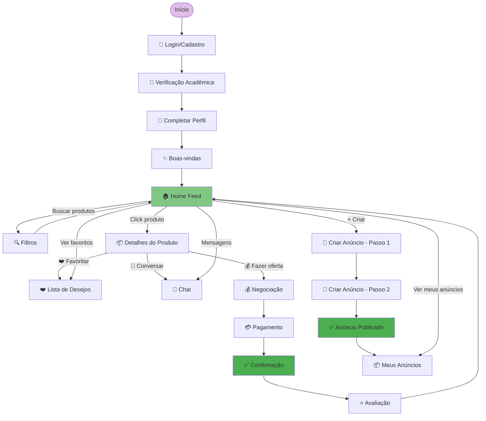
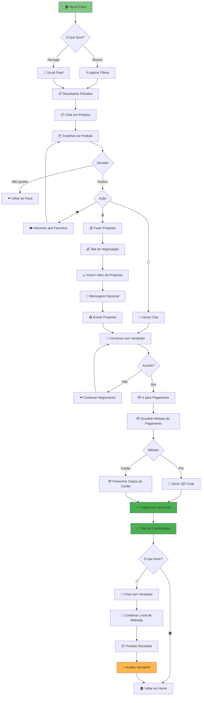
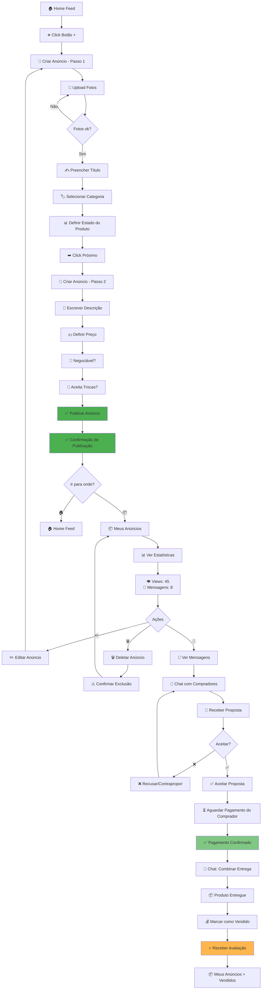
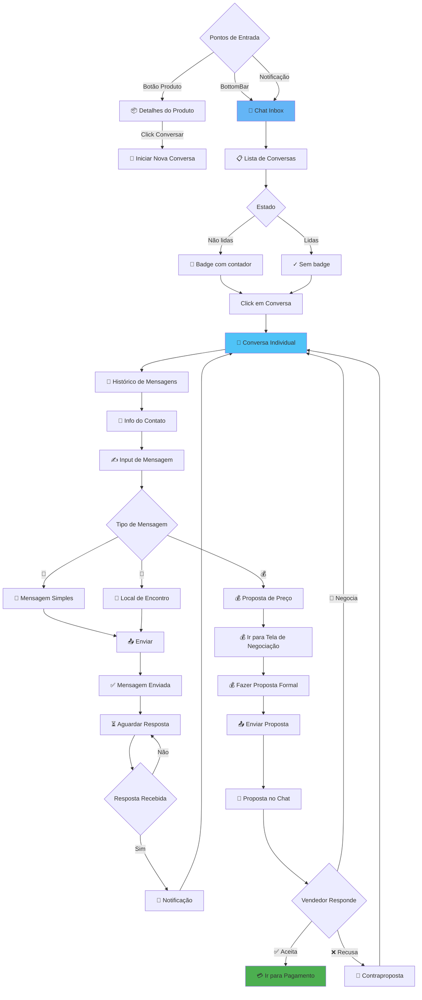
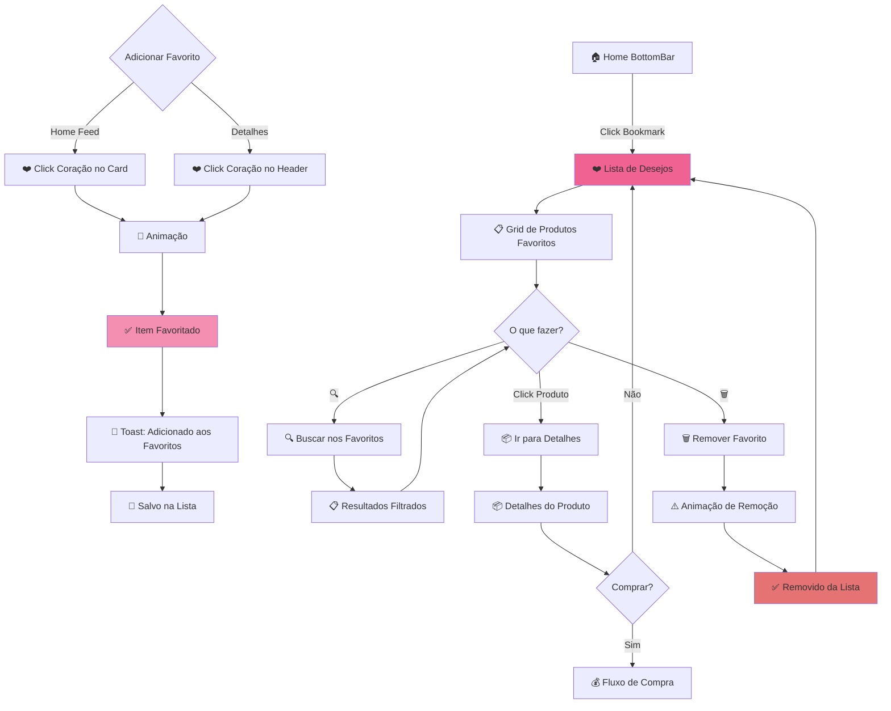
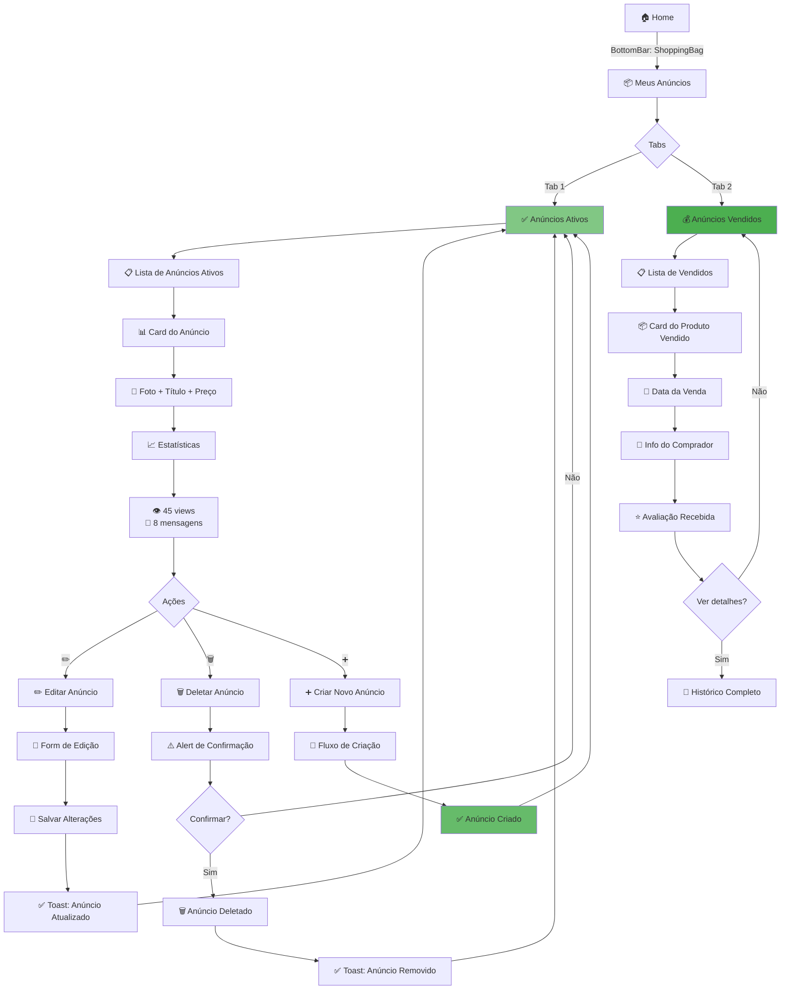
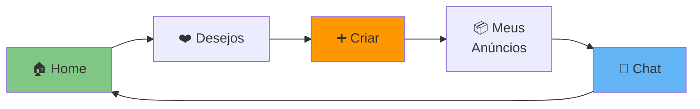
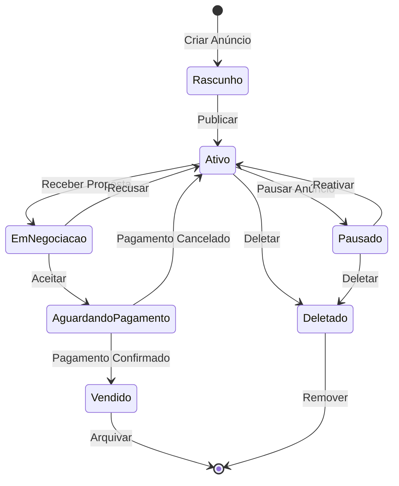
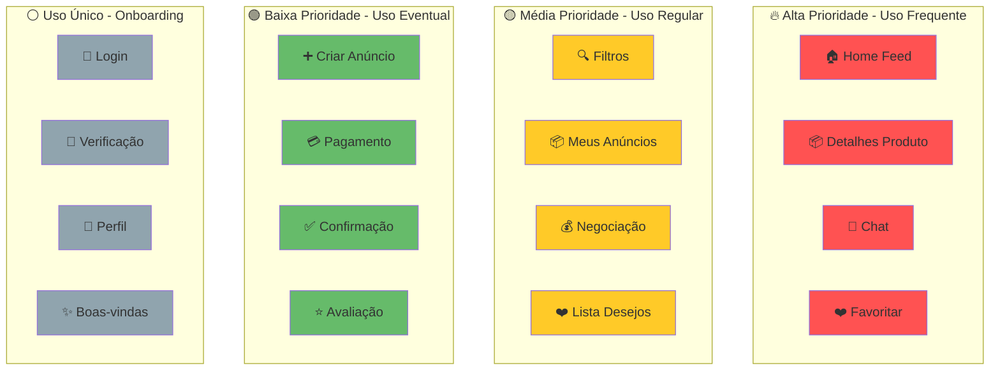

# 📊 Diagramas Visuais - User Flow UniTrade

## 🎨 Fluxo Principal (Happy Path Completo)

---

## 🛍️ Fluxo de Compra Detalhado

---

## 💼 Fluxo de Venda Detalhado

---

## 💬 Fluxo de Comunicação (Chat)

---

## ❤️ Fluxo de Favoritos (Wishlist)

---

## 📦 Fluxo de Gerenciamento de Anúncios

---

## 🔄 Navegação Bottom Bar (Menu Principal)

---

## 🎯 Estados de Produto

---

## 📊 Mapa de Calor de Interações (Prioridade)

---

## 🚦 Matriz de Complexidade vs Frequência

| Tela | Frequência de Uso | Complexidade | Prioridade UX |
|------|-------------------|--------------|---------------|
| Home Feed | 🔴 Muito Alta | 🟢 Baixa | ⭐⭐⭐⭐⭐ |
| Detalhes Produto | 🔴 Muito Alta | 🟡 Média | ⭐⭐⭐⭐⭐ |
| Chat | 🔴 Muito Alta | 🟡 Média | ⭐⭐⭐⭐⭐ |
| Filtros | 🟡 Alta | 🟢 Baixa | ⭐⭐⭐⭐ |
| Negociação | 🟡 Alta | 🟡 Média | ⭐⭐⭐⭐ |
| Criar Anúncio | 🟢 Média | 🔴 Alta | ⭐⭐⭐⭐ |
| Pagamento | 🟢 Média | 🔴 Alta | ⭐⭐⭐⭐⭐ |
| Meus Anúncios | 🟢 Média | 🟢 Baixa | ⭐⭐⭐ |
| Lista Desejos | 🟢 Média | 🟢 Baixa | ⭐⭐⭐ |
| Confirmação | 🟢 Baixa | 🟢 Baixa | ⭐⭐⭐ |
| Avaliação | 🟢 Baixa | 🟢 Baixa | ⭐⭐⭐ |
| Onboarding | ⚪ Uma vez | 🟡 Média | ⭐⭐⭐⭐⭐ |

**Legenda:**
- 🔴 = Alta
- 🟡 = Média
- 🟢 = Baixa
- ⚪ = Única

---

**📝 Como visualizar os diagramas:**
1. Copie o código Mermaid
2. Cole em: https://mermaid.live/
3. Ou use extensões Mermaid no VS Code

**Versão**: 1.0  
**Data**: 04/05/2026
