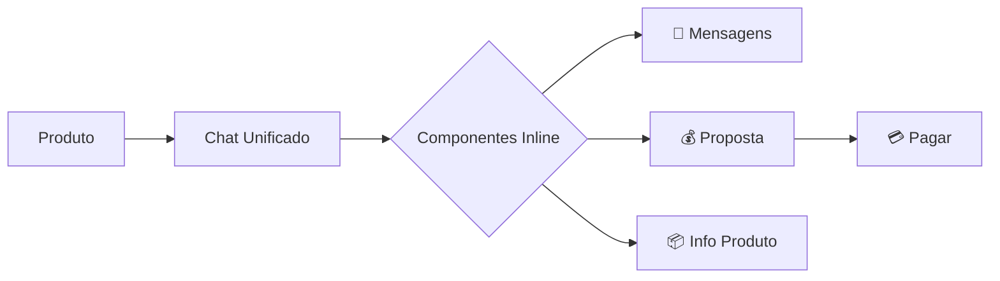

# 🎨 Recomendações de UX Design - UniTrade
## Otimizações e Melhorias Baseadas em User Flow

---

## 📋 Sumário Executivo

Este documento apresenta recomendações de UX Design baseadas na análise do User Flow do UniTrade, identificando oportunidades de melhoria, otimizações de navegação e estratégias para reduzir fricção nas jornadas principais.

---

## 🎯 Princípios de Design Aplicados

### 1. **Lei de Hick**
- Reduzir opções em momentos de decisão crítica
- **Aplicação**: Criar Anúncio possui apenas 2 passos claros

### 2. **Lei de Fitts**
- Botões importantes devem ser grandes e fáceis de alcançar
- **Aplicação**: Botão "+" de Criar centralizado no BottomBar

### 3. **Efeito Zeigarnik**
- Usuários lembram de tarefas incompletas
- **Aplicação**: Indicador de progresso nos passos de criação

### 4. **Efeito de Posição Serial**
- Primeira e última posição são mais lembradas
- **Aplicação**: Home e Chat nas extremidades do BottomBar

---

## 🔴 CRÍTICO: Pontos de Fricção Identificados

### 1. Onboarding - Verificação Acadêmica

**Problema Atual:**
```
Login → Verificação (Upload doc) → Aguardar aprovação
```

**Fricção:**
- Processo pode demorar
- Usuário pode abandonar antes de explorar o app
- Sem feedback de tempo de aprovação

**✅ Recomendação:**
```
Login → Perfil Provisório → Explorar App (limitado)
                    ↓
           Verificação em background
                    ↓
           Notificação quando aprovado
```

**Benefícios:**
- ↓ Taxa de abandono no onboarding
- ↑ Engajamento imediato
- Usuário conhece valor do app antes de esperar

**Implementação:**
```typescript
// Permitir navegação com perfil não-verificado
const canViewProducts = true; // Sempre permitido
const canCreateAd = user.isVerified; // Requer verificação
const canPurchase = user.isVerified; // Requer verificação

// Badge visual
if (!user.isVerified) {
  showBanner("Complete sua verificação para começar a vender");
}
```

---

### 2. Fluxo de Compra - Múltiplas Idas ao Chat

**Problema Atual:**
```
Produto → Chat → Negociação → Chat → Pagamento
        ↑________↓            ↑_____↓
     (Múltiplas idas e vindas)
```

**Fricção:**
- Usuário perde contexto
- Muitos taps para fechar negociação
- Experiência fragmentada

**✅ Recomendação: Unificar Chat + Negociação**



**Implementação:**
```typescript
// Chat com actions contextuais
<Chat>
  <MessageThread />
  <ProductSummary /> {/* Sempre visível */}
  <QuickActions>
    <MakeOfferButton /> {/* Inline no chat */}
    <AcceptOfferButton /> {/* Para vendedor */}
  </QuickActions>
</Chat>
```

**Benefícios:**
- ↓ Cliques: 5 → 2
- ↑ Taxa de conversão
- Melhor contexto

---

### 3. Criar Anúncio - Upload de Fotos

**Problema Atual:**
- Usuário precisa adicionar fotos uma a uma
- Sem preview antes do upload
- Limite de 3 fotos não é claro inicialmente

**✅ Recomendação: Upload Múltiplo + Crop**

```typescript
// Upload múltiplo com drag & drop
<ImageUpload
  maxFiles={3}
  multiSelect={true}
  showPreview={true}
  allowCrop={true}
  acceptedFormats={['jpg', 'png', 'heic']}
  compressionQuality={0.8}
/>

// Feedback visual
"Adicione até 3 fotos (2/3)" // Contador dinâmico
```

**Melhorias Adicionais:**
- Reordenar fotos (drag & drop)
- Crop/rotate antes do upload
- Compressão automática para economia de dados

---

### 4. Pagamento - Transparência de Custos

**Problema Atual:**
```
Produto: R$ 250
         ↓
Negociação: R$ 225
         ↓
Pagamento: R$ 230 (+ taxa de R$ 5)
         ↑
    🚨 Surpresa!
```

**Fricção:**
- Taxa surpresa no último momento
- Pode causar abandono

**✅ Recomendação: Mostrar Custos Antecipadamente**

```typescript
// Em Detalhes do Produto
<PriceBreakdown>
  <Price>R$ 250</Price>
  <ServiceFee>+ R$ 5 taxa</ServiceFee>
  <Total>R$ 255 total</Total>
</PriceBreakdown>

// Durante Negociação
"Sua oferta: R$ 225 + R$ 5 taxa = R$ 230 total"
```

**Benefícios:**
- ↑ Confiança do usuário
- ↓ Abandono no pagamento
- Transparência total

---

## 🟡 IMPORTANTE: Oportunidades de Melhoria

### 5. Busca e Descoberta

**Estado Atual:**
- Busca simples por keyword
- Filtros em tela separada

**✅ Recomendação: Busca Inteligente**

**Features:**
```typescript
// Autocomplete com sugestões
<SearchBar>
  onSearch={(query) => {
    showSuggestions([
      "Livros de Medicina", // Categoria popular
      "Tênis Nike", // Produto popular
      "João Silva", // Vendedor
    ]);
  }}
</SearchBar>

// Filtros rápidos inline
<QuickFilters>
  <Chip>Até R$ 100</Chip>
  <Chip>Meu curso</Chip>
  <Chip>Apenas trocas</Chip>
</QuickFilters>

// Histórico de buscas
<SearchHistory>
  "Calculadora científica"
  "Mochila preta"
</SearchHistory>
```

**Melhorias de Descoberta:**
```typescript
// Seção "Para você"
<PersonalizedFeed
  basedOn={[
    user.course, // Produtos do mesmo curso
    user.searchHistory,
    user.wishlist,
  ]}
/>

// Trending no campus
<TrendingSection>
  "🔥 Mais buscados esta semana"
  "📚 Livros para prova de Cálculo II"
  "👟 Calçados novos"
</TrendingSection>
```

---

### 6. Notificações Inteligentes

**Estado Atual:**
- Notificações genéricas

**✅ Recomendação: Push Contextual**

**Tipos de Notificação:**

| Trigger | Timing | Mensagem | CTA |
|---------|--------|----------|-----|
| Item favoritado com desconto | Imediato | "❤️ Tênis Nike agora R$ 200 (-20%)" | Ver produto |
| Produto similar ao wishlist | Diário | "Novos produtos como você gosta" | Explorar |
| Proposta recebida | Imediato | "💰 João ofereceu R$ 220 no seu tênis" | Ver proposta |
| Chat sem resposta (vendedor) | 2h | "💬 Maria está esperando sua resposta" | Responder |
| Produto sem venda (7 dias) | Semanal | "💡 Dica: Reduza o preço para vender mais rápido" | Editar |
| Verificação aprovada | Imediato | "✅ Conta verificada! Comece a vender" | Criar anúncio |

**Implementação:**
```typescript
// Notificações priorizadas
const notificationPriority = {
  payment_received: 'CRITICAL',
  offer_received: 'HIGH',
  message_received: 'MEDIUM',
  price_drop_wishlist: 'MEDIUM',
  weekly_summary: 'LOW',
};

// Smart timing
const shouldSendNotification = (type, user) => {
  // Não enviar durante horário de aula
  if (user.schedule.isInClass()) return false;
  
  // Agrupar notificações de baixa prioridade
  if (type === 'LOW') {
    return user.preferences.dailyDigestTime;
  }
  
  return true;
};
```

---

### 7. Gamificação e Engajamento

**Oportunidade:**
- Aumentar retenção
- Incentivar comportamentos positivos

**✅ Recomendação: Sistema de Reputação**

```typescript
// Perfil do usuário
<UserProfile>
  <ReputationBadge level="Vendedor Confiável" />
  <Stats>
    ⭐ 4.9 (24 avaliações)
    🏆 15 vendas completas
    ⚡ Responde em < 1h
    ✅ 100% entregas no prazo
  </Stats>
</UserProfile>

// Badges/Conquistas
const achievements = [
  {
    id: 'first_sale',
    title: '🎉 Primeira Venda',
    description: 'Complete sua primeira venda',
    reward: 'Badge de Iniciante'
  },
  {
    id: 'fast_responder',
    title: '⚡ Resposta Rápida',
    description: 'Responda 10 mensagens em < 1h',
    reward: 'Badge de Comunicativo'
  },
  {
    id: 'eco_warrior',
    title: '♻️ Guerreiro Eco',
    description: 'Faça 5 trocas sustentáveis',
    reward: 'Badge Verde'
  }
];
```

**Progressão:**
```
Novo Membro → Membro Ativo → Vendedor Confiável → Top Seller
   (0-5)        (5-20)           (20-50)          (50+)
                                                    vendas
```

---

## 🟢 NICE TO HAVE: Features Futuras

### 8. Troca de Produtos (Escambo)

**User Flow:**
```
Produto A → "Aceita trocas" → Propor Produto B
                    ↓
           Match de Interesse
                    ↓
            Chat para acertar
                    ↓
           Confirmar troca (ambos)
                    ↓
              Encontro marcado
```

**Implementação:**
```typescript
<ProductDetails>
  {product.acceptsTrade && (
    <TradeButton onClick={() => {
      // Mostrar produtos do usuário
      showTradeModal(userProducts);
    }}>
      🔁 Propor Troca
    </TradeButton>
  )}
</ProductDetails>

// Modal de troca
<TradeModal>
  <YourProduct>Seu produto</YourProduct>
  <SwapIcon>🔄</SwapIcon>
  <TheirProduct>{targetProduct}</TheirProduct>
  <Message>Adicionar mensagem</Message>
  <SendTradeOffer />
</TradeModal>
```

---

### 9. Marketplace de Serviços

**Expansão:**
- Não apenas produtos físicos
- Serviços entre estudantes

**Exemplos:**
- 📚 Aulas particulares
- 💻 Help em programação
- 📝 Revisão de TCC
- 🎨 Design de logo
- 🎵 Professor de violão

**Diferencial:**
```typescript
<ServiceListing>
  <ServiceType>Aula particular de Cálculo</ServiceType>
  <Price>R$ 30/hora</Price>
  <Availability>
    Seg, Qua, Sex: 14h-18h
  </Availability>
  <SellerRating>⭐ 5.0 (12 alunos)</SellerRating>
  <BookButton>Agendar horário</BookButton>
</ServiceListing>
```

---

### 10. Social Features

**Comunidade:**
```typescript
// Feed social
<CommunityFeed>
  <Post type="review">
    "Acabei de comprar um livro com @maria_silva 
     Produto impecável! ⭐⭐⭐⭐⭐"
  </Post>
  
  <Post type="want">
    "Alguém tem calculadora HP12C para vender? 
     🔍 #Administração #Financas"
  </Post>
  
  <Post type="found">
    "Achei um livro de Física na biblioteca! 
     Se for seu, me mande mensagem 📚"
  </Post>
</CommunityFeed>

// Grupos por curso
<CourseGroups>
  <Group name="Engenharia Civil">
    1.234 membros
    <QuickAccess>
      Ver produtos do grupo
      Criar anúncio no grupo
    </QuickAccess>
  </Group>
</CourseGroups>
```

---

## 📊 Métricas de Sucesso (KPIs)

### Onboarding
```yaml
Meta:
  Taxa de conclusão: > 70%
  Tempo médio: < 5 min
  Drop-off maior: < Verificação (max 30%)

Métricas:
  - completion_rate
  - time_to_home
  - abandonment_per_step
```

### Compra
```yaml
Meta:
  Conversão (View → Purchase): > 5%
  Tempo médio de compra: < 30 min
  Taxa de abandono no pagamento: < 20%

Métricas:
  - product_view_to_purchase
  - average_purchase_time
  - payment_abandonment_rate
  - offer_acceptance_rate
```

### Venda
```yaml
Meta:
  Anúncios criados/usuário/mês: > 1.5
  Taxa de conclusão criação: > 80%
  Tempo até primeira venda: < 7 dias

Métricas:
  - ads_created_per_user
  - creation_completion_rate
  - time_to_first_sale
  - average_sale_time
```

### Engajamento
```yaml
Meta:
  DAU/MAU ratio: > 25%
  Sessões/usuário/semana: > 5
  Tempo médio de sessão: > 4 min
  Taxa de retenção D7: > 40%

Métricas:
  - daily_active_users
  - sessions_per_user
  - session_duration
  - retention_rate_d7
  - retention_rate_d30
```

### Comunicação
```yaml
Meta:
  Taxa de resposta: > 70%
  Tempo médio de resposta: < 2h
  Mensagens/conversa: > 5

Métricas:
  - message_response_rate
  - average_response_time
  - messages_per_conversation
  - conversations_to_sale_rate
```

---

## 🧪 Testes A/B Sugeridos

### Teste 1: Botão "Fazer Oferta"
```yaml
Variante A: Botão separado
Variante B: Integrado no chat
Métrica: Taxa de conversão
Hipótese: Integração aumentará ofertas em 15%
```

### Teste 2: Upload de Fotos
```yaml
Variante A: Upload sequencial
Variante B: Upload múltiplo
Métrica: Taxa de conclusão de criação
Hipótese: Upload múltiplo reduzirá abandono em 20%
```

### Teste 3: Verificação Acadêmica
```yaml
Variante A: Obrigatório antes de explorar
Variante B: Permitir exploração, verificar depois
Métrica: Taxa de conclusão onboarding
Hipótese: Exploração prévia aumentará conclusão em 30%
```

### Teste 4: Notificações de Preço
```yaml
Variante A: Sem notificação
Variante B: Notificar quando favorito tem desconto
Métrica: Taxa de conversão de favoritos
Hipótese: Notificação aumentará compras em 25%
```

---

## 🎨 Padrões de Design Recomendados

### Feedback Visual

```typescript
// Loading states
<ProductCard loading={true}>
  <Skeleton /> {/* Shimmer effect */}
</ProductCard>

// Success states
<Toast type="success">
  ✅ Anúncio publicado com sucesso!
</Toast>

// Error states
<Alert type="error">
  ❌ Erro ao enviar proposta. Tente novamente.
</Alert>

// Empty states
<EmptyState
  icon="📭"
  title="Nenhuma mensagem ainda"
  description="Comece uma conversa com vendedores"
  action={<Button>Explorar produtos</Button>}
/>
```

### Micro-interações

```typescript
// Favoritar produto
<HeartButton
  onPress={() => {
    // 1. Animação de escala
    scale.value = withSpring(1.2);
    
    // 2. Mudar cor
    color.value = withTiming(COLORS.red);
    
    // 3. Confetti sutil
    showConfetti({ count: 10 });
    
    // 4. Haptic feedback
    Haptics.impactAsync(HapticFeedbackStyle.Medium);
  }}
/>

// Enviar mensagem
<SendButton
  onPress={() => {
    // 1. Slide out animation
    slideOut();
    
    // 2. Aparecer no histórico
    slideIn();
    
    // 3. Som de envio
    playSound('message_sent');
  }}
/>
```

### Skeleton Loading

```typescript
// Feed de produtos
<Grid>
  {loading ? (
    Array(6).fill(null).map((_, i) => (
      <SkeletonCard key={i}>
        <SkeletonImage />
        <SkeletonText lines={2} />
        <SkeletonPrice />
      </SkeletonCard>
    ))
  ) : (
    products.map(renderProduct)
  )}
</Grid>
```

---

## ♿ Acessibilidade

### WCAG 2.1 Compliance

```typescript
// Contraste mínimo
const COLORS = {
  primary: '#7c3aed', // Ratio: 4.5:1 ✅
  text: '#1f2937',    // Ratio: 12:1 ✅
  textLight: '#6b7280' // Ratio: 4.8:1 ✅
};

// Tamanho mínimo de toque
<Button
  minHeight={44}
  minWidth={44}
  accessible={true}
  accessibilityLabel="Fazer oferta de compra"
  accessibilityHint="Abre tela para negociar preço"
/>

// Labels descritivos
<Image
  source={productImage}
  accessibilityLabel={`Foto do produto ${productTitle}`}
/>

// Navegação por teclado
<Input
  accessibilityRole="search"
  returnKeyType="search"
  onSubmitEditing={handleSearch}
/>
```

### Modo Escuro

```typescript
// Theme switcher
const theme = useColorScheme();

const THEMES = {
  light: {
    background: '#ffffff',
    text: '#1f2937',
    card: '#f9fafb'
  },
  dark: {
    background: '#111827',
    text: '#f9fafb',
    card: '#1f2937'
  }
};
```

---

## 📱 Performance

### Otimizações de Carregamento

```typescript
// Lazy loading de imagens
<Image
  source={{ uri: imageUrl }}
  placeholder={blurhash}
  transition={300}
  cachePolicy="memory-disk"
/>

// Pagination infinita
<FlatList
  data={products}
  onEndReached={loadMore}
  onEndReachedThreshold={0.5}
  ListFooterComponent={<LoadingSpinner />}
/>

// Code splitting
const ChatScreen = lazy(() => import('./screens/Chat'));
const PaymentScreen = lazy(() => import('./screens/Payment'));

// Prefetch de dados
useEffect(() => {
  // Prefetch likely next screen
  if (currentScreen === 'ProductDetails') {
    prefetch('chat', productId);
  }
}, [currentScreen]);
```

### Bundle Size

```yaml
Target:
  Initial load: < 2MB
  Images (compressed): < 200KB each
  Total app size: < 50MB

Estratégias:
  - Lazy load screens
  - Image compression (WebP)
  - Tree shaking
  - Code minification
```

---

## 🔐 Segurança e Privacidade

### Proteções Implementadas

```typescript
// Validação de email universitário
const isValidUniversityEmail = (email) => {
  const universityDomains = [
    '@usp.br',
    '@ufrj.br',
    '@ufmg.br',
    // ...
  ];
  return universityDomains.some(domain => email.endsWith(domain));
};

// Sanitização de inputs
const sanitizeInput = (text) => {
  return DOMPurify.sanitize(text, {
    ALLOWED_TAGS: [],
    ALLOWED_ATTR: []
  });
};

// Rate limiting de mensagens
const canSendMessage = (userId) => {
  const limit = 10; // mensagens por minuto
  const count = getMessageCount(userId, '1m');
  return count < limit;
};

// Moderação de conteúdo
const moderateContent = async (text) => {
  const inappropriate = await checkForInappropriateContent(text);
  if (inappropriate) {
    flagForReview(text);
    return false;
  }
  return true;
};
```

### LGPD Compliance

```typescript
// Consentimento explícito
<PrivacyConsent>
  "Usamos seus dados para melhorar a experiência.
   Você pode alterar isso em Configurações."
  <AcceptButton />
  <RejectButton />
</PrivacyConsent>

// Direito ao esquecimento
const deleteUserData = async (userId) => {
  await Promise.all([
    deleteMessages(userId),
    deleteProducts(userId),
    deleteProfile(userId),
    anonymizeTransactions(userId)
  ]);
};

// Exportação de dados
const exportUserData = async (userId) => {
  const data = {
    profile: await getProfile(userId),
    products: await getProducts(userId),
    messages: await getMessages(userId),
    transactions: await getTransactions(userId)
  };
  return JSON.stringify(data);
};
```

---

## 🎓 Conclusão

### Priorização de Implementação

**Fase 1 - MVP (4 semanas):**
- ✅ Fluxo de onboarding completo
- ✅ Home feed + busca básica
- ✅ Criar anúncio (2 passos)
- ✅ Chat básico
- ✅ Pagamento PIX

**Fase 2 - Otimizações (3 semanas):**
- 🔄 Verificação em background
- 🔄 Chat + Negociação unificados
- 🔄 Upload múltiplo de fotos
- 🔄 Notificações push

**Fase 3 - Crescimento (4 semanas):**
- 📈 Sistema de reputação
- 📈 Busca inteligente
- 📈 Gamificação
- 📈 Analytics completo

**Fase 4 - Expansão (6 semanas):**
- 🚀 Marketplace de serviços
- 🚀 Social features
- 🚀 Grupos por curso
- 🚀 Programa de embaixadores

---

**Próximos Passos:**
1. ✅ Protótipo clicável no Figma
2. ⏳ Testes de usabilidade com 10 estudantes
3. ⏳ Iteração baseada em feedback
4. ⏳ Desenvolvimento do MVP
5. ⏳ Beta test no campus

---

**Documento criado em**: 04/05/2026  
**Versão**: 1.0  
**Aprovado por**: UX Design Team
